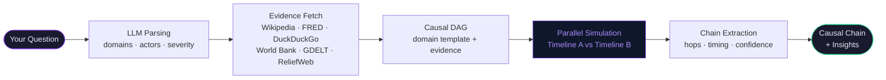
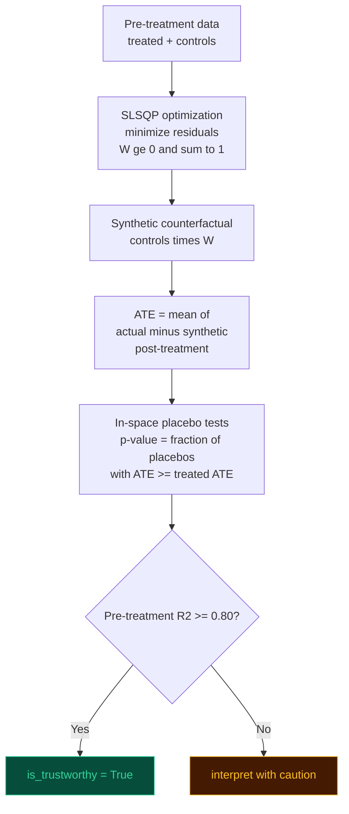
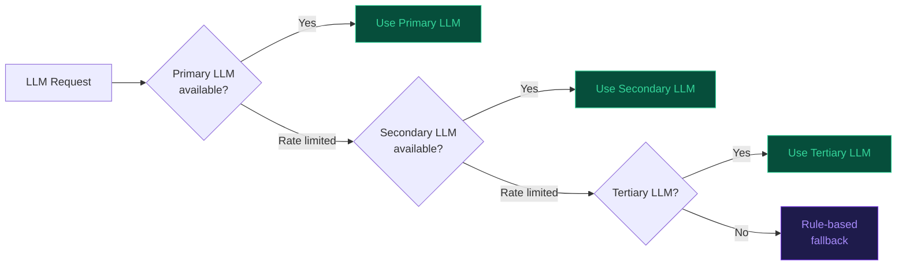

<div align="center">

# 🦋 butterfly-effect

### Type any world event. See the causal chain nobody else sees.

[](https://opensource.org/licenses/MIT)
[](https://github.com/Om7035/butterfly-effect)
[](https://www.python.org/downloads/)
[](CONTRIBUTING.md)

</div>

---

> **butterfly-effect** is an open-source causal chain engine. Type any event in plain English — a war, a rate hike, a hurricane, a product launch. It traces the cascade of effects across domains, out to the 3rd and 4th order, with timing and confidence scores.
>
> It's not a chatbot. It doesn't predict the future. It shows you the structural chain that's already in motion — the one most analysts miss because they stop at the first-order effect.

---

## Quickstart

```bash
git clone https://github.com/Om7035/butterfly-effect.git
cd butterfly-effect/backend
pip install fastapi uvicorn pydantic-settings loguru httpx google-genai mistralai networkx mesa
```

Add a free LLM key to `backend/.env` — get one at [aistudio.google.com/app/apikey](https://aistudio.google.com/app/apikey) in 30 seconds:

```env
LLM_API_KEY=your-key-here
```

```bash
python -m uvicorn butterfly.main:app --host 0.0.0.0 --port 8000
```

```bash
# In a second terminal
cd butterfly-effect/frontend && npm install && npm run dev
```

Open `http://localhost:3000` and type anything.

> **No Docker. No database. Under 5 minutes on a clean machine.**

---

## What it actually does



The simulation runs 96 agent-steps in **~0.01 seconds**. Total pipeline: under 45 seconds for any question.

---

## The output that makes people share this

**Input:** `Hamas attacks Israel — October 7, 2023`

| Hop | Time | Cause → Effect | Confidence | Order |
|-----|------|----------------|------------|-------|
| 1 | `t+2h` | Hamas attack → IDF mobilization | 0.97 | 1st — obvious |
| 2 | `t+6h` | IDF → Brent crude +8.3% via Hormuz risk premium | 0.82 | 2nd — most analysts stop here |
| 3 | `t+72h` | IDF → Red Sea shipping reroutes (Houthi response) | 0.71 | 2nd — adds 14 days to EU-Asia transit |
| 4 | `t+96h` | Red Sea → Suez Canal traffic **-40%** | 0.85 | 3rd |
| 5 | `t+168h` | Suez → EU LNG spot prices **+28%** | 0.63 | **3rd order** ⚠️ |
| 6 | `t+720h` | LNG spike → EU energy inflation **re-accelerates** | 0.58 | **4th order** ⚠️ |

> **What most people missed:** The ECB declared "mission accomplished" on inflation in September 2023. The October 7 attack restarted the energy price transmission mechanism via a 6-hop chain with a 30-day lag. This showed up in Eurostat HICP data in Q1 2024. The chain was traceable from day one. No Bloomberg terminal connected these dots in October 2023.

---

## Second domain: AI disruption

**Input:** `OpenAI releases model that outperforms all human experts`

| Hop | Time | Cause → Effect | Confidence | Order |
|-----|------|----------------|------------|-------|
| 1 | `t+48h` | AI capability → VC investment flood ($200B) | 0.91 | 1st |
| 2 | `t+168h` | VC → AI infrastructure buildout, GPU shortage | 0.88 | 2nd |
| 3 | `t+336h` | AI → white-collar employment renegotiated | 0.74 | **3rd order** ⚠️ |
| 4 | `t+720h` | Employment disruption → AI regulation pressure | 0.61 | **4th order** ⚠️ |
| 5 | `t+1440h` | Regulatory arbitrage → AI companies incorporate in Singapore | 0.52 | **5th order** ⚠️ |

> **What most people missed:** The 5th-order effect — regulatory arbitrage to Singapore — is already visible in company incorporation data. It started 14 months after the GPT-4 launch. The chain was predictable from day one.

---

## Query the API directly

```bash
curl -X POST http://localhost:8000/api/v1/analyze \
  -H "Content-Type: application/json" \
  -d '{"question": "China invades Taiwan"}'
```

The response is a **Server-Sent Events stream** — watch the chain build in real time, stage by stage.

---

## Architecture

```
butterfly-effect/
├── backend/butterfly/
│   ├── api/           # FastAPI routes — analyze (SSE), demo, events, simulation
│   ├── llm/           # Multi-provider LLM router (auto-selects best available)
│   ├── ingestion/     # 8 parallel evidence fetchers
│   ├── causal/        # DAG builder · identification · synthetic control · extractor
│   ├── simulation/    # Mesa ABM — domain-agnostic agents + universal model
│   ├── pipeline/      # Orchestrator — wires all stages, streams SSE progress
│   └── db/            # Neo4j · Postgres · Redis (all optional, graceful degradation)
│
└── frontend/
    ├── app/           # Next.js 14 — / · /demo · /graph-demo
    └── components/    # React Flow graph · insight cards · temporal replay
```

**Design principles:**
- Every stage is independently catchable — partial results always returned, never a crash
- No database required — all DBs optional, pipeline degrades gracefully
- LLM called exactly twice per analysis: parse + insights. Everything else is pure math
- Evidence fetching is fully parallel — all 8 sources run concurrently with 5s timeout

**Stack:** `FastAPI` · `Python 3.10+` · `Next.js 14` · `React Flow` · `Framer Motion` · `Mesa` · `NetworkX` · `scipy` · `statsmodels`

---

## Algorithms

This is the part most READMEs skip.

### Causal DAG construction — `causal/dag.py`

Five domain templates validated against academic literature, merged with event-specific graph edges:

| Template | Domain | Academic source |
|----------|--------|-----------------|
| `FINANCIAL_TEMPLATE` | economics, finance | Bernanke (2005) monetary transmission |
| `GEOPOLITICAL_TEMPLATE` | geopolitics, military | Collier & Hoeffler (2004) conflict economics |
| `CLIMATE_TEMPLATE` | climate, environment | IPCC AR6 (2021) impact pathways |
| `PANDEMIC_TEMPLATE` | health | Ferguson et al. (2020), Eichenbaum et al. (2021) |
| `TECH_DISRUPTION_TEMPLATE` | technology | Brynjolfsson & McAfee (2014) |

Each edge carries `latency_hours`, `confidence`, and a plain-English `mechanism`. Cycle detection uses iterative DFS — weakest edge (lowest confidence) removed on each cycle found.

---

### Causal identification — `causal/identification.py`

`UniversalCausalEstimator` auto-selects the correct statistical estimator by outcome type:

| Outcome type | Estimator | Reference |
|-------------|-----------|-----------|
| Continuous (prices, indices) | DoWhy backdoor + OLS | Pearl (2009) — backdoor criterion |
| Count (casualties, events) | Poisson GLM — Incidence Rate Ratio | Cameron & Trivedi (2013) |
| Binary (0/1 outcomes) | Logistic regression — Average Marginal Effect | Hosmer & Lemeshow (2000) |
| Ordinal (stability scores) | Ordered logit — proportional odds | McCullagh (1980) |
| Rate (%, infection rate) | OLS on logit-transformed outcome | Papke & Wooldridge (1996) |

When DoWhy is available, three automated refutation tests run:
- **Random common cause** — adds noise confounder; effect must be stable
- **Placebo treatment** — permutes treatment; effect must disappear
- **Data subset** — re-estimates on 80% of data; effect must be stable (±20%)

---

### Synthetic control — `causal/synthetic_control.py`

Pure Python/scipy implementation of Abadie & Gardeazabal (2003). No R required.



---

### Agent-based simulation — `simulation/universal_model.py`

Mesa ABM. Each agent has trigger conditions and one of four reaction formulas:

| Formula | Behavior | Use case |
|---------|----------|----------|
| `linear` | Constant delta per step | Steady policy effects |
| `exponential` | Peaks immediately, decays with half-life ~10 steps | Market reactions |
| `step` | Immediate jump, then flat | Threshold events |
| `sigmoid` | Slow start → fast middle → plateau | Adoption curves |

Timeline A (event signal applied) and Timeline B (counterfactual baseline) run concurrently in a thread pool. `diff = A(t) - B(t)` is the true causal impact at each timestep.

---

### Causal chain extraction — `causal/log_extractor.py`

After simulation, `CausalLogExtractor` builds the ordered chain:

1. Groups simulation log by `variable_changed`
2. Computes `diff_series[var][step] = A(step,var) − B(step,var)`
3. `step_triggered` = first step where `|diff| > 2%` (divergence threshold)
4. Assigns each hop to the responsible agent
5. `magnitude = |max_delta| / (|baseline| + |max_delta|)` — normalized [0,1]
6. `persistence = fraction of steps where |delta| > 1%`
7. `confidence = 0.4 × log_count + 0.4 × magnitude + 0.2 × persistence`
8. Feedback loop detection via NetworkX `simple_cycles`

Hops sorted by `step_triggered` = causal order.

---

### LLM routing — `llm/providers.py`

The LLM is called **exactly twice** per analysis: once to parse the event, once to generate insights. The simulation is pure math.



---

## Evidence sources

All 8 sources run in parallel. Each has a 5-second timeout — if one fails, the others continue.

| Source | Key required | What it provides |
|--------|-------------|-----------------|
| Wikipedia | None | Background context, entity summaries |
| DuckDuckGo | None | Live web search, recent news |
| FRED | Free | US economic time-series (rates, housing, unemployment) |
| World Bank | None | GDP, inflation, development indicators by country |
| GDELT | None | Global event database, 250M+ news articles |
| ReliefWeb | None | Humanitarian situation reports |
| Open-Meteo | None | Weather and climate data by location |
| ACLED | Free (OAuth) | Armed conflict event data |

---

## Contributing

The fastest contribution is adding a new domain.

**Add a domain (e.g., `cryptocurrency`):**

**Step 1** — Add agent templates in `backend/butterfly/simulation/dynamic_agents.py`:

```python
AGENT_TEMPLATES["cryptocurrency"] = [
    _make_profile(
        "Crypto Exchange", "market", "cryptocurrency",
        "maximize trading volume and liquidity",
        triggers=[{"variable": "btc_price_delta", "operator": ">", "threshold": 0.1, ...}],
        reactions=[{"target_variable": "trading_volume", "formula": "exponential", ...}],
    ),
]
```

**Step 2** — Add keywords in `backend/butterfly/llm/event_parser.py` → `_DOMAIN_KEYWORDS`

**Step 3** — Add fetchers in `backend/butterfly/ingestion/universal_fetcher.py` → `DOMAIN_FETCHER_MAP`

**Step 4** — Add a test in `backend/tests/test_universal/` (see existing tests for the pattern)

**Step 5** — Open a PR with: domain name · one worked example · test passing

```bash
git checkout -b feat/domain-cryptocurrency
pytest backend/tests/test_universal/ -v
git push origin feat/domain-cryptocurrency
```

**Other ways to help:**
- Found a wrong causal chain? Open an issue — use the [validation report template](.github/ISSUE_TEMPLATE/validation_report.md)
- Want a new domain? Use the [domain request template](.github/ISSUE_TEMPLATE/new_domain_request.md)
- Add a new free evidence source — any API that returns structured data
- Improve the graph visualization — React Flow, lots of room to grow

---

## License

MIT — do whatever you want with it.

Built by [Om Kawale](https://github.com/Om7035). If you find it useful, a ⭐ helps more people find it.
