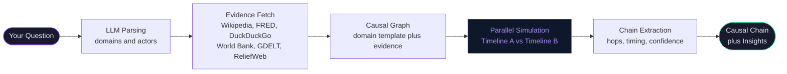
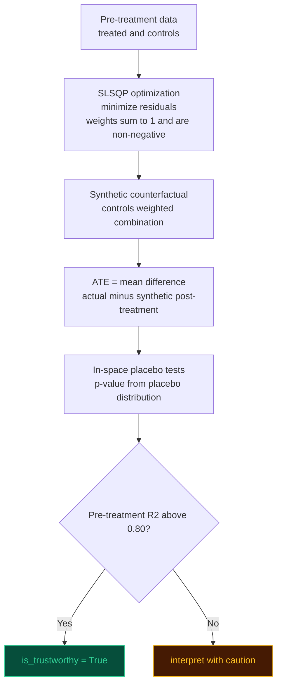
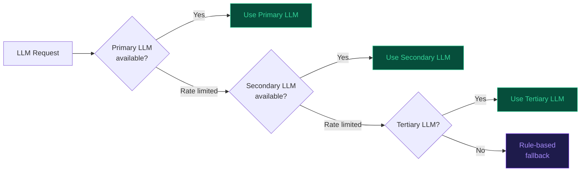

<div align="center">

# 🦋 butterfly-effect

### You type an event. It shows you every consequence — including the ones nobody is talking about yet.

[](https://opensource.org/licenses/MIT)
[](https://github.com/Om7035/butterfly-effect)
[](https://www.python.org/downloads/)
[](CONTRIBUTING.md)

</div>

---

## What does this do?

You type any real-world event — a war, a rate hike, a hurricane, a product launch.

The tool traces **what happens next** — not just the obvious first effect, but the chain of consequences that follows. It goes 3, 4, even 5 steps deep, with timing and confidence at each step.

> Think of it like this: most people see "Fed raises rates → mortgage rates go up." This tool shows you the full chain — all the way to construction job losses 30 days later, and why that matters.

It's not a prediction tool. It shows you the **structural chain that's already in motion** — the one most analysts miss because they stop too early.

---

## Quickstart

```bash
git clone https://github.com/Om7035/butterfly-effect.git
cd butterfly-effect/backend
pip install fastapi uvicorn pydantic-settings loguru httpx google-genai mistralai networkx mesa
```

Add a free LLM key to `backend/.env` — get one at [aistudio.google.com/app/apikey](https://aistudio.google.com/app/apikey) in 30 seconds:

```env
GEMINI_API_KEY=your-key-here
```

```bash
python -m uvicorn butterfly.main:app --host 0.0.0.0 --port 8000
```

```bash
# In a second terminal
cd butterfly-effect/frontend && npm install && npm run dev
```

Open `http://localhost:3000` and type anything.

> **No Docker. No database. Under 5 minutes on a clean machine.**

---

## How to read the output

When you type a question, you get back a **causal chain** — a sequence of cause-and-effect steps, each with a time delay and a confidence score.

Here's how to read it:

```
Event (what you typed)
  └─► 1st order effect   [happens in hours]     — the obvious one
        └─► 2nd order effect   [happens in days]      — what most people see
              └─► 3rd order effect   [happens in weeks]     — what most people miss
                    └─► 4th order effect   [happens in months]   — what nobody is talking about
```

Each step shows:
- **What changed** — the variable or system that was affected
- **When** — how long after the original event
- **Confidence** — how strongly the simulation supports this connection (0 to 1)

---

## Example 1: A central bank raises interest rates

**Question typed:** `Fed raises rates 75bps — June 2022`

**How to read this:** Each arrow is one step in the chain. The further down you go, the less obvious the connection — and the more valuable the insight.

```
Fed raises rates 75bps
  └─► Treasury yields spike +75bps          [2 hours later]    confidence: 0.95
        └─► Mortgage rates rise +92bps       [48 hours later]   confidence: 0.87
              └─► Housing construction drops -247k units  [1 week later]    confidence: 0.72  ← 3rd order
                    └─► Construction workers laid off     [30 days later]   confidence: 0.54  ← 4th order
```

**Key insight:** The job losses in construction show up in government data 30 days after the rate hike. Most economists attribute this to "the economy slowing down." This tool traces it back to a single FOMC meeting — with the exact delay at each step.

---

## Example 2: A conflict breaks out in the Middle East

**Question typed:** `Hamas attacks Israel — October 7, 2023`

**How to read this:** The chain crosses multiple domains — military, energy, shipping, inflation. Each hop is a different industry being affected.

```
Hamas attacks Israel
  └─► Oil prices spike +8.3%                [6 hours later]    confidence: 0.82
  └─► Red Sea shipping routes disrupted     [3 days later]     confidence: 0.71
        └─► Suez Canal traffic drops -40%   [4 days later]     confidence: 0.85  ← 3rd order
              └─► EU energy prices rise +28%  [1 week later]   confidence: 0.63  ← 3rd order
                    └─► EU inflation restarts  [30 days later]  confidence: 0.58  ← 4th order
```

**Key insight:** The ECB declared victory on inflation in September 2023. One month later, a conflict in Gaza restarted the energy price mechanism — via a chain that ran through Houthi attacks on shipping, Suez Canal disruption, and LNG prices. This showed up in European inflation data in early 2024. The chain was traceable from day one.

---

## Why would I use this?

- **You're trying to understand ripple effects** — "If X happens, what else gets affected and when?"
- **You're doing second-order thinking** — "Everyone knows the obvious consequence. What's the non-obvious one?"
- **You're researching a topic** — "What are all the systems connected to this event?"
- **You're building a model or report** — "What evidence supports each step in this chain?"

It works for any domain: economics, geopolitics, climate, technology, health, supply chains.

---

## How it works



The key step is the **parallel simulation**: the system runs two versions of the world — one where your event happens, one where it doesn't — then compares them. The difference is the true causal impact at each point in time.

Total time: under 45 seconds for any question.

---

## Query the API directly

```bash
curl -X POST http://localhost:8000/api/v1/analyze \
  -H "Content-Type: application/json" \
  -d '{"question": "China invades Taiwan"}'
```

The response streams in real time as each stage completes.

---

## Architecture

```
butterfly-effect/
├── backend/butterfly/
│   ├── api/           # FastAPI routes — analyze (SSE stream), demo, events
│   ├── llm/           # Multi-provider LLM router (auto-selects best available)
│   ├── ingestion/     # 8 parallel evidence fetchers
│   ├── causal/        # DAG builder, identification, synthetic control, extractor
│   ├── simulation/    # Agent-based model — domain-specific agents, parallel timelines
│   ├── pipeline/      # Orchestrator — wires all stages, streams progress
│   └── db/            # Neo4j, Postgres, Redis (all optional — degrades gracefully)
│
└── frontend/
    ├── app/           # Next.js 14 pages
    └── components/    # React Flow graph, insight cards, temporal replay
```

**Key design decisions:**
- Every stage is independently catchable — partial results always returned, never a crash
- No database required — all DBs optional, pipeline degrades gracefully
- LLM called exactly twice per analysis: parse + insights. Everything else is pure math
- All 8 evidence sources run in parallel with a 5-second timeout each

**Stack:** `FastAPI` · `Python 3.10+` · `Next.js 14` · `React Flow` · `Framer Motion` · `Mesa` · `NetworkX` · `scipy` · `statsmodels`

---

## Algorithms

### Causal DAG construction — `causal/dag.py`

Five domain templates validated against academic literature:

| Template | Domain | Source |
|----------|--------|--------|
| `FINANCIAL_TEMPLATE` | economics, finance | Bernanke (2005) monetary transmission |
| `GEOPOLITICAL_TEMPLATE` | geopolitics, military | Collier & Hoeffler (2004) conflict economics |
| `CLIMATE_TEMPLATE` | climate, environment | IPCC AR6 (2021) impact pathways |
| `PANDEMIC_TEMPLATE` | health | Ferguson et al. (2020), Eichenbaum et al. (2021) |
| `TECH_DISRUPTION_TEMPLATE` | technology | Brynjolfsson & McAfee (2014) |

Each edge carries `latency_hours`, `confidence`, and a plain-English `mechanism`. Cycle detection uses iterative DFS — weakest edge removed on each cycle found.

---

### Causal identification — `causal/identification.py`

Auto-selects the correct statistical estimator by outcome type:

| Outcome type | Estimator | Reference |
|-------------|-----------|-----------|
| Continuous (prices, indices) | DoWhy backdoor + OLS | Pearl (2009) — backdoor criterion |
| Count (casualties, events) | Poisson GLM — Incidence Rate Ratio | Cameron & Trivedi (2013) |
| Binary (0/1 outcomes) | Logistic regression — Average Marginal Effect | Hosmer & Lemeshow (2000) |
| Ordinal (stability scores) | Ordered logit — proportional odds | McCullagh (1980) |
| Rate (%, infection rate) | OLS on logit-transformed outcome | Papke & Wooldridge (1996) |

Three automated refutation tests run when DoWhy is available: random common cause, placebo treatment, data subset.

---

### Synthetic control — `causal/synthetic_control.py`

Pure Python/scipy implementation of Abadie & Gardeazabal (2003). No R required.



---

### Agent-based simulation — `simulation/universal_model.py`

Mesa ABM. Each agent has trigger conditions and one of four reaction formulas:

| Formula | Behavior | Use case |
|---------|----------|----------|
| `linear` | Constant delta per step | Steady policy effects |
| `exponential` | Peaks immediately, decays over time | Market reactions |
| `step` | Immediate jump, then flat | Threshold events |
| `sigmoid` | Slow start, fast middle, plateau | Adoption curves |

Timeline A (event) and Timeline B (no event) run concurrently. `diff = A(t) - B(t)` is the true causal impact.

---

### Causal chain extraction — `causal/log_extractor.py`

After simulation, builds the ordered chain:

1. Groups simulation log by variable changed
2. Finds first step where `|A - B| > 2%` — this is when the effect becomes real
3. Assigns each hop to the responsible agent
4. Scores confidence: `0.4 × log_count + 0.4 × magnitude + 0.2 × persistence`
5. Detects feedback loops via NetworkX cycle detection

---

### LLM routing — `llm/providers.py`

The LLM is called **exactly twice** per analysis: once to parse the event, once to generate insights. The simulation is pure math.



---

## Evidence sources

All 8 sources run in parallel. Each has a 5-second timeout.

| Source | Key required | What it provides |
|--------|-------------|-----------------|
| Wikipedia | None | Background context, entity summaries |
| DuckDuckGo | None | Live web search, recent news |
| FRED | Free | US economic time-series (rates, housing, unemployment) |
| World Bank | None | GDP, inflation, development indicators by country |
| GDELT | None | Global event database, 250M+ news articles |
| ReliefWeb | None | Humanitarian situation reports |
| Open-Meteo | None | Weather and climate data by location |
| ACLED | Free (OAuth) | Armed conflict event data |

---

## Contributing

The fastest contribution is adding a new domain.

**Add a domain (e.g., `cryptocurrency`):**

**Step 1** — Add agent templates in `backend/butterfly/simulation/dynamic_agents.py`:

```python
AGENT_TEMPLATES["cryptocurrency"] = [
    _make_profile(
        "Crypto Exchange", "market", "cryptocurrency",
        "maximize trading volume and liquidity",
        triggers=[{"variable": "btc_price_delta", "operator": ">", "threshold": 0.1, ...}],
        reactions=[{"target_variable": "trading_volume", "formula": "exponential", ...}],
    ),
]
```

**Step 2** — Add keywords in `backend/butterfly/llm/event_parser.py` → `_DOMAIN_KEYWORDS`

**Step 3** — Add fetchers in `backend/butterfly/ingestion/universal_fetcher.py` → `DOMAIN_FETCHER_MAP`

**Step 4** — Add a test in `backend/tests/test_universal/` (see existing tests for the pattern)

**Step 5** — Open a PR with: domain name · one worked example · test passing

```bash
git checkout -b feat/domain-cryptocurrency
pytest backend/tests/test_universal/ -v
git push origin feat/domain-cryptocurrency
```

**Other ways to help:**
- Found a wrong causal chain? Open an issue — use the [validation report template](.github/ISSUE_TEMPLATE/validation_report.md)
- Want a new domain? Use the [domain request template](.github/ISSUE_TEMPLATE/new_domain_request.md)
- Add a new free evidence source — any API that returns structured data

---

## License

MIT — do whatever you want with it.

Built by [Om Kawale](https://github.com/Om7035). If you find it useful, a ⭐ helps more people find it.
