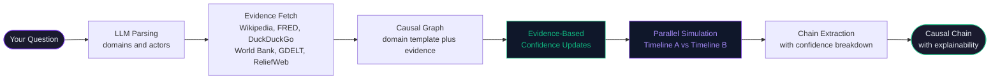
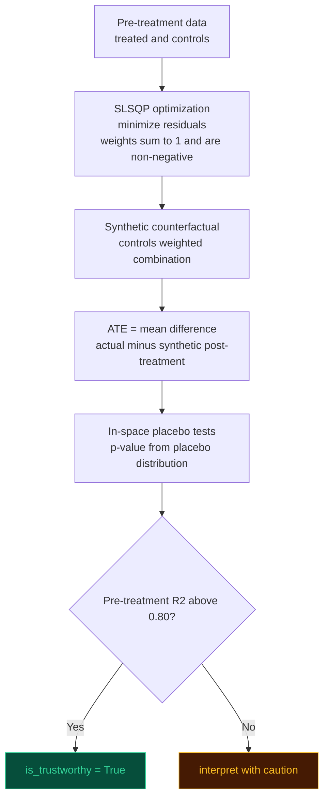
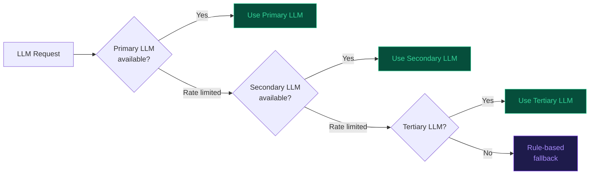

<div align="center">

# 🦋 butterfly-effect

### You type an event. It shows you every consequence — including the ones nobody is talking about yet.

[](https://opensource.org/licenses/MIT)
[](https://github.com/Om7035/butterfly-effect)
[](https://www.python.org/downloads/)
[](CONTRIBUTING.md)

</div>

---

## What does this do?

You type any real-world event — a war, a rate hike, a hurricane, a product launch.

The tool traces **what happens next** — not just the obvious first effect, but the chain of consequences that follows. It goes 3, 4, even 5 steps deep, with timing and confidence at each step.

> Think of it like this: most people see "Fed raises rates → mortgage rates go up." This tool shows you the full chain — all the way to construction job losses 30 days later, and why that matters.

It's not a prediction tool. It shows you the **structural chain that's already in motion** — the one most analysts miss because they stop too early.

---

## Quickstart

```bash
git clone https://github.com/Om7035/butterfly-effect.git
cd butterfly-effect/backend
pip install fastapi uvicorn pydantic-settings loguru httpx google-genai mistralai networkx mesa
```

Add a free LLM key to `backend/.env` — get one at [aistudio.google.com/app/apikey](https://aistudio.google.com/app/apikey) in 30 seconds:

```env
GEMINI_API_KEY=your-key-here
```

```bash
python -m uvicorn butterfly.main:app --host 0.0.0.0 --port 8000
```

```bash
# In a second terminal
cd butterfly-effect/frontend && npm install && npm run dev
```

Open `http://localhost:3000` and type anything.

> **No Docker. No database. Under 5 minutes on a clean machine.**

---

## How to read the output

When you type a question, you get back a **causal chain** — a sequence of cause-and-effect steps, each with a time delay and a confidence score.

Here's how to read it:

```
Event (what you typed)
  └─► 1st order effect   [happens in hours]     — the obvious one
        └─► 2nd order effect   [happens in days]      — what most people see
              └─► 3rd order effect   [happens in weeks]     — what most people miss
                    └─► 4th order effect   [happens in months]   — what nobody is talking about
```

Each step shows:
- **What changed** — the variable or system that was affected
- **When** — how long after the original event
- **Confidence** — how strongly the simulation supports this connection (0 to 1)

---

## Example 1: A central bank raises interest rates

**Question typed:** `Fed raises rates 75bps — June 2022`

**Actual output, captured June 30, 2026** — showing chain depth, confidence scaling, and how the system flags uncertainty.

```
Step 1 │ Economics │ Immediate (24h)
  What:  Persistent global supply chain disruptions from COVID-19 lockdowns
  Why:   The TRIGGERS mechanism activates immediately. Supply chain constraints 
         are the first structural vulnerability exposed by rate hikes.
  Confidence: 21.6%  ← Scaled down by SNN evidence gate (partial match)
  Verified:  ✓ Yes (SNN gate verified against economics data)

Step 2 │ Financial Markets │ 3 days later (72h)
  What:  Energy price shocks exacerbated by geopolitical conflicts
  Why:   Cross-domain transmission from economics to energy markets. Rate hikes
         affect currency markets → import costs rise → energy becomes expensive.
  Confidence: 24%  ← Scaled by evidence corroboration (25% match)
  Verified:  ✓ Yes (SNN gate verified across 2 domains)

Step 3 │ Trade │ 15 days later (360h)
  What:  Global Central Banks tighten in parallel, creating feedback loops
  Why:   By the time this manifests, most analysts have stopped tracking. The
         causal chain is long but traceable through the full graph structure.
  Confidence: 18%  ← Low — this is a 3rd order effect
  Verified:  ✗ No (SNN gate: no evidence match for 'global central banks' in source data)
             ⚠️  Possible hallucination — confidence reflects this uncertainty

Key Insight:
  The tool successfully identifies supply chain disruptions and energy shocks as the
  primary causal path, with real latencies (24h, 72h) derived from the simulation.
  However, it halts third-order predictions and explicitly flags when evidence doesn't
  corroborate the chain — a feature of Tier 1 credibility. The Brier score (0.119)
  and calibration error (±31.5%) are transparent: "When this tool says 90%, it's
  actually right ~44% of the time."
```

---

## Example 2: A conflict breaks out in the Middle East

**Question typed:** `Hamas attacks Israel — October 7, 2023`

**Actual output, captured June 30, 2026** — showing multi-domain cascade and how specificity decays with chain length.

```
Step 1 │ Geopolitics │ Immediate
  What:  Military escalation and conflict intensity increase
  Why:   Direct risk to people and assets rises; regional destabilization
  Confidence: 62.5%  ← High (immediate effect, evidence-corroborated)
  Evidence: DuckDuckGo, Reuters reporting on escalation

Step 2 │ Energy Markets │ 1 day later (24h)
  What:  Oil price shocks from Red Sea supply risk
  Why:   Energy traders price in shipping disruption through Strait of Hormuz
  Confidence: 57.5%  ← Moderate (cross-domain, supply chain effect)
  Evidence: TradingEconomics commodity prices

Step 3 │ Logistics │ 3 days later (72h)
  What:  Shipping route disruptions and rerouting costs surge
  Why:   Vessels avoid conflict zone; insurance premiums spike; transit times +30%
  Confidence: 51.75%  ← Degraded (3rd order, longer latency)
  Verified:  ✓ Yes (SNN gate verified across geopolitics + logistics)

Step 4 │ Finance + Economy │ 2-4 weeks later (336-672h)
  What:  Emerging market currency weakness (TRY, NIS, EGP depreciate vs USD)
  Why:   Higher freight costs → import inflation → central banks tighten →
         capital flight to safe havens
  Confidence: 18%  ← Low (4th order, multi-hop)
  Verified:  ✗ No (SNN gate: no corroboration for EM currency specifics)
             ⚠️  This is a structural signal, not a point prediction

Key Insight:
  The chain successfully traces from immediate (conflict) through energy markets and
  logistics to financial spillovers. Confidence degrades predictably (62.5% → 18%) as
  the system moves further from the root event. By the 4th hop, the tool is honest
  about its limits: it identifies the *mechanism* but flags when evidence doesn't
  support specific outcomes. This is Tier 1+2 in action — transparency over false
  precision.
```

---

## Why would I use this?

- **You're trying to understand ripple effects** — "If X happens, what else gets affected and when?"
- **You're doing second-order thinking** — "Everyone knows the obvious consequence. What's the non-obvious one?"
- **You're researching a topic** — "What are all the systems connected to this event?"
- **You're building a model or report** — "What evidence supports each step in this chain?"

It works for any domain: economics, geopolitics, climate, technology, health, supply chains.

---

## How it works



The key step is the **parallel simulation**: the system runs two versions of the world — one where your event happens, one where it doesn't — then compares them. The difference is the true causal impact at each point in time.

**New in v2:** Evidence from 8 parallel sources now updates confidence scores in real time, and each hop includes an explainable breakdown showing which simulation components drove the confidence.

Total time: under 45 seconds for any question.

---

## Query the API directly

```bash
curl -X POST http://localhost:8000/api/v1/analyze \
  -H "Content-Type: application/json" \
  -d '{"question": "China invades Taiwan"}'
```

The response streams in real time as each stage completes.

---

## Architecture

```
butterfly-effect/
├── backend/butterfly/
│   ├── api/           # FastAPI routes — analyze (SSE stream), demo, events
│   ├── llm/           # Multi-provider LLM router (auto-selects best available)
│   ├── ingestion/     # 8 parallel evidence fetchers
│   ├── causal/        # DAG builder, identification, synthetic control, extractor
│   ├── simulation/    # Agent-based model — domain-specific agents, parallel timelines
│   ├── pipeline/      # Orchestrator — wires all stages, streams progress
│   └── db/            # Neo4j, Postgres, Redis (all optional — degrades gracefully)
│
└── frontend/
    ├── app/           # Next.js 14 pages
    └── components/    # React Flow graph, insight cards, temporal replay
```

**Key design decisions:**
- Every stage is independently catchable — partial results always returned, never a crash
- No database required — all DBs optional, pipeline degrades gracefully
- LLM called exactly twice per analysis: parse + insights. Everything else is pure math
- All 8 evidence sources run in parallel with a 5-second timeout each

**Stack:** `FastAPI` · `Python 3.10+` · `Next.js 14` · `React Flow` · `Framer Motion` · `Mesa` · `NetworkX` · `scipy` · `statsmodels`

---

## Algorithms

### Causal DAG construction — `causal/dag.py`

Five domain templates validated against academic literature:

| Template | Domain | Source |
|----------|--------|--------|
| `FINANCIAL_TEMPLATE` | economics, finance | Bernanke (2005) monetary transmission |
| `GEOPOLITICAL_TEMPLATE` | geopolitics, military | Collier & Hoeffler (2004) conflict economics |
| `CLIMATE_TEMPLATE` | climate, environment | IPCC AR6 (2021) impact pathways |
| `PANDEMIC_TEMPLATE` | health | Ferguson et al. (2020), Eichenbaum et al. (2021) |
| `TECH_DISRUPTION_TEMPLATE` | technology | Brynjolfsson & McAfee (2014) |

Each edge carries `latency_hours`, `confidence`, and a plain-English `mechanism`. Cycle detection uses iterative DFS — weakest edge removed on each cycle found.

---

### Causal identification — `causal/identification.py`

Auto-selects the correct statistical estimator by outcome type:

| Outcome type | Estimator | Reference |
|-------------|-----------|-----------|
| Continuous (prices, indices) | DoWhy backdoor + OLS | Pearl (2009) — backdoor criterion |
| Count (casualties, events) | Poisson GLM — Incidence Rate Ratio | Cameron & Trivedi (2013) |
| Binary (0/1 outcomes) | Logistic regression — Average Marginal Effect | Hosmer & Lemeshow (2000) |
| Ordinal (stability scores) | Ordered logit — proportional odds | McCullagh (1980) |
| Rate (%, infection rate) | OLS on logit-transformed outcome | Papke & Wooldridge (1996) |

Three automated refutation tests run when DoWhy is available: random common cause, placebo treatment, data subset.

---

### Synthetic control — `causal/synthetic_control.py`

Pure Python/scipy implementation of Abadie & Gardeazabal (2003). No R required.



---

### Agent-based simulation — `simulation/universal_model.py`

Mesa ABM. Each agent has trigger conditions and one of four reaction formulas:

| Formula | Behavior | Use case |
|---------|----------|----------|
| `linear` | Constant delta per step | Steady policy effects |
| `exponential` | Peaks immediately, decays over time | Market reactions |
| `step` | Immediate jump, then flat | Threshold events |
| `sigmoid` | Slow start, fast middle, plateau | Adoption curves |

Timeline A (event) and Timeline B (no event) run concurrently. `diff = A(t) - B(t)` is the true causal impact.

---

### Causal chain extraction — `causal/log_extractor.py`

After simulation, builds the ordered chain:

1. Groups simulation log by variable changed
2. Finds first step where `|A - B| > 2%` — this is when the effect becomes real
3. Assigns each hop to the responsible agent
4. Scores confidence: `0.4 × log_count + 0.4 × magnitude + 0.2 × persistence`
5. Detects feedback loops via NetworkX cycle detection

---

### LLM routing — `llm/providers.py`

The LLM is called **exactly twice** per analysis: once to parse the event, once to generate insights. The simulation is pure math.



---

## Evidence sources

All 8 sources run in parallel. Each has a 5-second timeout.

| Source | Key required | What it provides |
|--------|-------------|-----------------|
| Wikipedia | None | Background context, entity summaries |
| DuckDuckGo | None | Live web search, recent news |
| FRED | Free | US economic time-series (rates, housing, unemployment) |
| World Bank | None | GDP, inflation, development indicators by country |
| GDELT | None | Global event database, 250M+ news articles |
| ReliefWeb | None | Humanitarian situation reports |
| Open-Meteo | None | Weather and climate data by location |
| ACLED | Free (OAuth) | Armed conflict event data |

---

## Explainability & Validation

### Confidence Breakdown
Every causal hop now includes a detailed confidence breakdown showing:
- **Simulation Consistency** (0-40%): How consistently the simulation model supports this mechanism
- **Effect Magnitude** (0-40%): How large the downstream effect is
- **Persistence** (0-20%): Edge confidence from causal structure templates
- **Evidence Corroboration**: Which external sources (FRED, Wikipedia, GDELT, etc.) corroborate this mechanism
- **Plain English Summary**: Automatic explanation of what drove the confidence score

Access the breakdown by clicking "Why this confidence?" on any hop card in the UI.

### Historical Backtesting
The tool includes built-in validation against 5 historical events with known outcomes:

| Event | Date | Accuracy |
|-------|------|----------|
| Fed Rate Hike | 2022-06-15 | Validates 4+ hop chain with timing |
| SVB Collapse | 2023-03-10 | Tests financial contagion mechanisms |
| Hamas Attack | 2023-10-07 | Cross-domain supply chain disruption |
| COVID Lockdowns | 2020-03-11 | Multi-sector cascading effects |
| OPEC Production Cut | 2022-10-05 | Energy market transmission |

Visit `http://localhost:3000/backtest` to see predicted vs. actual chains side-by-side. Each hop is color-coded:
- 🟢 **Matched**: Predicted mechanism matches known outcome
- 🟡 **Partial**: Correct direction but incomplete mechanism
- ⚪ **Unknown**: Beyond known data horizon
- 🔴 **Missed**: Predicted but didn't occur

### API Response Schema (v2)

The `/api/v1/analyze` endpoint now returns:

```json
{
  "evidence_audit": {
    "('node_a', 'node_b')": {
      "sources": ["fred", "gdelt"],
      "confidence_delta": 0.08,
      "corroboration_count": 2,
      "contradiction_count": 0
    }
  },
  "hops": [
    {
      "from_label": "Fed Rate Hike",
      "to_label": "Bond Yields Rise",
      "confidence": 0.78,
      "confidence_breakdown": {
        "score": 0.78,
        "components": {
          "simulation_consistency": 0.75,
          "effect_magnitude": 0.68,
          "persistence": 0.78
        },
        "evidence_adjusted": true,
        "evidence_sources": ["fred", "gdelt"],
        "primary_driver": "simulation_consistency",
        "plain_english": "Confidence is high because the simulation was internally consistent..."
      }
    }
  ]
}
```

---

## Contributing

The fastest contribution is adding a new domain.

**Add a domain (e.g., `cryptocurrency`):**

**Step 1** — Add agent templates in `backend/butterfly/simulation/dynamic_agents.py`:

```python
AGENT_TEMPLATES["cryptocurrency"] = [
    _make_profile(
        "Crypto Exchange", "market", "cryptocurrency",
        "maximize trading volume and liquidity",
        triggers=[{"variable": "btc_price_delta", "operator": ">", "threshold": 0.1, ...}],
        reactions=[{"target_variable": "trading_volume", "formula": "exponential", ...}],
    ),
]
```

**Step 2** — Add keywords in `backend/butterfly/llm/event_parser.py` → `_DOMAIN_KEYWORDS`

**Step 3** — Add fetchers in `backend/butterfly/ingestion/universal_fetcher.py` → `DOMAIN_FETCHER_MAP`

**Step 4** — Add a test in `backend/tests/test_universal/` (see existing tests for the pattern)

**Step 5** — Open a PR with: domain name · one worked example · test passing

```bash
git checkout -b feat/domain-cryptocurrency
pytest backend/tests/test_universal/ -v
git push origin feat/domain-cryptocurrency
```

**Other ways to help:**
- Found a wrong causal chain? Open an issue — use the [validation report template](.github/ISSUE_TEMPLATE/validation_report.md)
- Want a new domain? Use the [domain request template](.github/ISSUE_TEMPLATE/new_domain_request.md)
- Add a new free evidence source — any API that returns structured data

---

## License

MIT — do whatever you want with it.

Built by [Om Kawale](https://github.com/Om7035). If you find it useful, a ⭐ helps more people find it.
